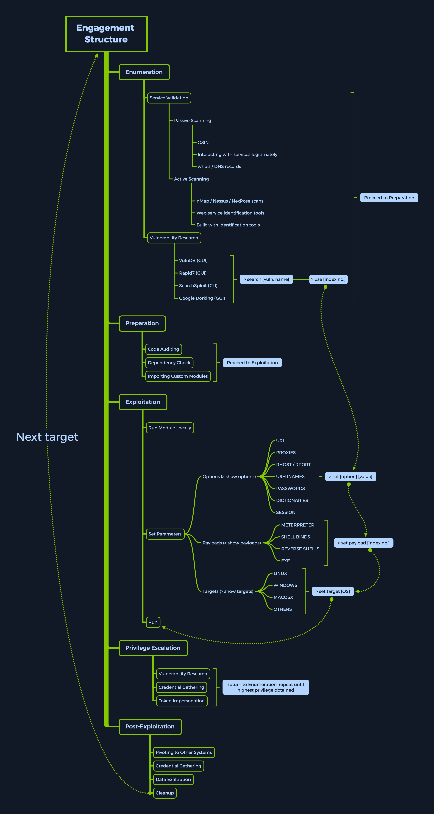

:PROPERTIES:
:ID:       6aeb476f-4796-4ccd-9e81-c7fd01e25f5c
:END:
#+title: metasploit
#+OPTIONS: toc:2

* TOC :toc:
- [[#msf-engagement-structure][MSF engagement structure]]
- [[#syntax][Syntax]]
- [[#specific-search][Specific Search]]

* MSF engagement structure
- Enumeration
- Preparation
- Exploitation
- Privilege Escalation
- Post-exploitation

* Syntax
- ~<No.> <type>/<os>/<service>/<name>~
- eg: ~794   exploit/windows/ftp/scriptftp_list~

* Specific Search
- ~search type:exploit platform:windows cve:2021 rank:excellent microsoft~
